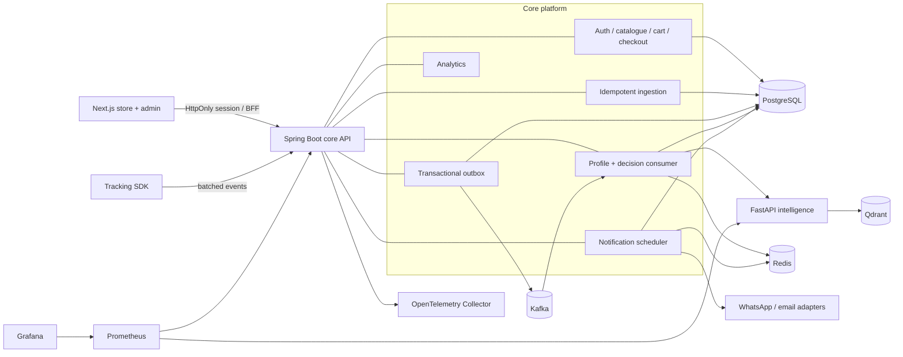
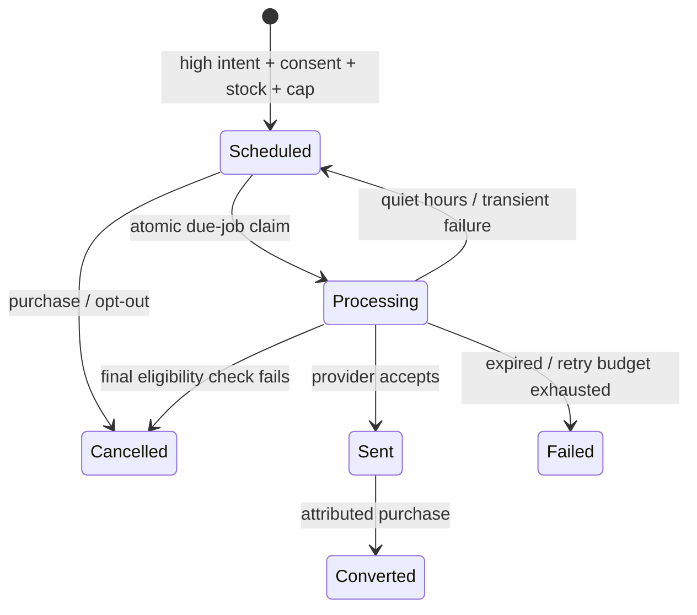

# Architecture and reliability

## Runtime topology



## Core boundaries

The Spring service is a modular monolith: identity, catalogue, commerce, ingestion, profiles, decisions, scheduling, delivery, and analytics have separate packages but share one database transaction manager. This is deliberate. Stock decrement, order creation, purchase emission, and reminder cancellation commit atomically.

The CPU/model-oriented profile and recommendation code is already extracted behind a versioned FastAPI contract. Kafka decouples event receipt from profile recalculation. These are the first components that benefit from independent scaling; splitting every CRUD domain would add failure modes without improving the demo.

## Event delivery

1. The SDK sends at most 100 events per request without blocking navigation.
2. PostgreSQL accepts each `event_id` once and stores `occurred_at` separately from `received_at`.
3. The same transaction writes an outbox row. The API never attempts a database/Kafka dual write.
4. Outbox workers atomically claim rows with `FOR UPDATE SKIP LOCKED`, publish with the user/anonymous identity as the Kafka key, then mark the row published.
5. Consumers update the profile and decision state before committing their offset. Processing is safe to repeat.
6. Transient exceptions retry with exponential delay; exhausted records are published to a dead-letter topic.

This design tolerates duplicate and out-of-order delivery. A production deployment should add a schema registry and a consumer-inbox table if a new consumer performs a non-idempotent side effect.

## Scoring and recommendations

The explainable rule baseline applies a 72-hour half-life:

```text
event contribution = configured weight × 2 ^ (-age_hours / 72)
intent score = clamp(1 - exp(-sum(contributions)), 0, 1)
```

Cart, checkout, repeat views, comparisons, specific searches, and page duration outweigh casual views. The response includes the leading contributions and a model/policy version.

Recommendations combine deterministic 64-dimensional content embeddings, category and brand affinity, price fit, recent interaction strength, quality, and popularity. Qdrant stores catalogue vectors; a bounded local cosine fallback keeps scoring available if vector search is temporarily unhealthy. Purchased, unavailable, blocked, anchor, and out-of-range products are removed before ranking.

The baseline is suitable for generating a labelled dataset, not for inventing an accuracy claim. A learned model must use time-based train/test splits, calibrate probabilities, monitor drift, and retain decision explanations.

## Notification lifecycle



PostgreSQL is canonical. Redis contains only a due-time index and can be rebuilt by the scheduler repair sweep. A partial unique index suppresses concurrent active jobs for the same user/product/template. The worker rechecks opt-out, channel consent, purchase, inventory, expiry, cap, and quiet hours after claiming the job. Provider requests use the job ID as the idempotency key.

## Failure controls

| Scenario | Control |
|---|---|
| Kafka delivers twice | Event ID uniqueness; profile overwrite; active-job unique index |
| Events arrive out of order | Event-time decay; separate receive timestamp |
| Consumer crashes | Database commit precedes offset commit; safe replay |
| Provider unavailable | Exponential backoff with jitter, retry cap, expiration |
| Purchase races delivery | Transactional job claim plus delivery-time purchase check |
| Product unavailable | Decision-time and delivery-time inventory checks |
| AI times out | Tight client timeouts; event remains retryable; prior profile is retained |
| Redis restarts | AOF plus PostgreSQL-to-Redis repair sweep |
| User opts out | Pending jobs cancelled and consent rechecked at delivery |
| Multiple devices | Stable user Kafka key; globally unique event/session IDs |
| API overload | Request validation, batch cap, Redis rate limiting, horizontal replicas |

## Security and operations

- Passwords are BCrypt-hashed; JWT signing keys come from secrets and browser tokens remain in HttpOnly cookies.
- Customer resources always derive their user identity from the verified token.
- Admin endpoints require the `ADMIN` role.
- The API applies validation, controlled error payloads, CORS allow-listing, security headers, and per-route rate limits.
- Liveness and readiness probes are separate from application metrics.
- Trace export uses OTLP; Spring and FastAPI metrics are scraped by Prometheus.
- Kubernetes templates include non-root containers, resource requests/limits, rolling updates, disruption budgets, autoscaling, and default-deny network policies.

For an internet-facing environment, add TLS, WAF/bot controls, managed secrets, database encryption/backups, Kafka ACLs, audit retention, dependency/container scanning, data deletion workflows, provider webhook signature validation, and an incident-response runbook.
